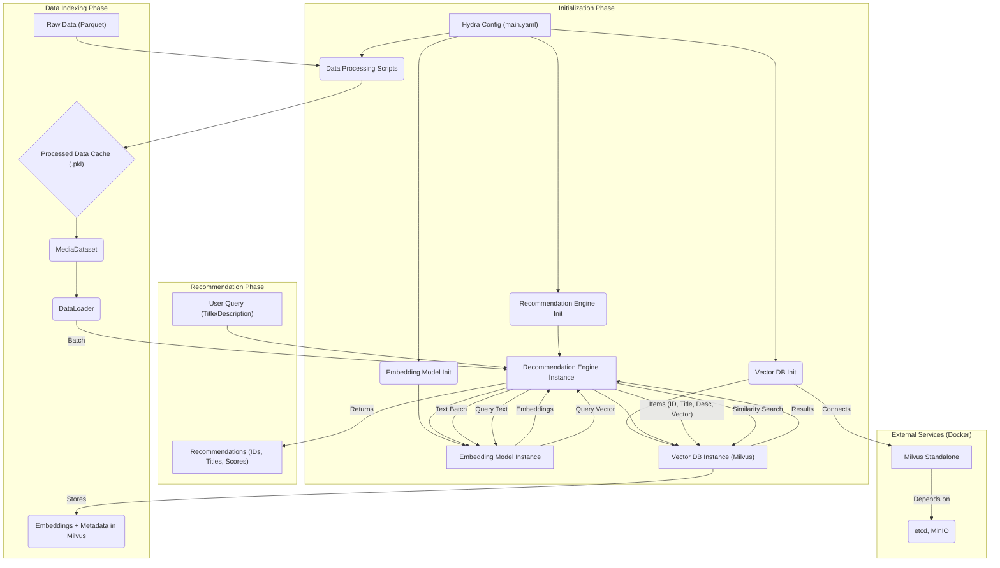
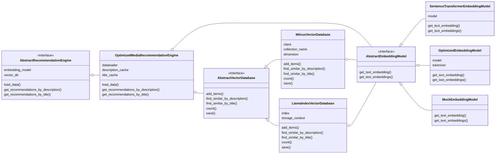

# Project Design Documentation

## 1. Overall System Architecture

* **Description:** The system is a media recommender (specifically focused on Anime based on current data processing) that leverages semantic understanding of titles and descriptions. It follows a configurable, pipeline architecture driven by Hydra:
    1. **Configuration Loading (Hydra):** Reads `config/main.yaml` and associated sub-configs (`process/`, `model/`) to determine parameters like data paths, model choices, database settings, etc.
    2. **Data Ingestion & Processing:** Raw data (e.g., Parquet from `data.path` in config) is loaded. Scripts like `src/data_processing_anime.py` perform cleaning, transformation (handling dates, genres, NaNs), and feature engineering. Processed data can be cached (`data.processed_path`).
    3. **Dataset Loading:** A `MediaDataset` (or `AnimeDataset`) reads the processed data, preparing it for batch processing by a PyTorch `DataLoader`.
    4. **Embedding Model Initialization:** Based on `embedding_model.type` and `embedding_model.model_name` config, an `AbstractEmbeddingModel` implementation (e.g., `SentenceTransformerEmbeddingModel`) is instantiated.
    5. **Vector Database Initialization:** Based on `vector_database.type` config, an `AbstractVectorDatabase` implementation (e.g., `MilvusVectorDatabase`) is instantiated using the factory function `create_vector_database`. It connects to the database service (e.g., Milvus via Docker) and ensures the collection schema and index are set up.
    6. **Recommendation Engine Initialization:** The `OptimizedMediaRecommendationEngine` is created, linking the embedding model and vector database. It initializes the `DataLoader` and LRU caches.
    7. **Data Indexing:** The `load_data` method iterates through the `DataLoader`, generates embeddings for batches of media items using the embedding model, and inserts the items (ID, title, description, vector) into the vector database.
    8. **Recommendation Serving:** The engine waits for user queries. Upon receiving a query (title or description):
        a.  Checks the LRU cache.
        b.  If not cached, generates the query embedding using the embedding model.
        c.  Searches the vector database for similar vectors using ANN (HNSW index in Milvus).
        d.  Stores the result in the cache and returns it.
* **Architecture Diagram (Updated):**



* **Class Diagram (Core Components):**



## 2. Communication Protocols Between Agents/Components

* **Hydra -> Components:** Hydra injects configuration values (from YAML files) as parameters into the constructors or functions (e.g., `embedding_model`, `vector_db`, `recommendation_engine` initializers).
* **Recommendation Engine <-> DataLoader:** The engine iterates through the `DataLoader` provided by `torch.utils.data`. The `DataLoader` reads batches of data (IDs, titles, descriptions) from the underlying `MediaDataset`.
* **Recommendation Engine <-> Embedding Model:** Direct Python method calls (`get_text_embeddings` during indexing, `get_text_embedding` during querying). `asyncio.to_thread` is used within embedding models to run potentially CPU-bound inference in a separate thread, preventing blocking of the main async event loop.
* **Recommendation Engine <-> Vector Database (Milvus):** Uses the `pymilvus` client library over TCP/IP.
  * **Protocol:** Milvus SDK (gRPC based).
  * **Address:** Configured via Hydra (`vector_database.uri`), e.g., `http://localhost:19530`.
  * **Key Operations:** `insert` (during indexing), `search` (during querying), `load_collection`, `flush`, `count`.
* **Data Processing Scripts <-> Filesystem:** Standard Python file I/O (`pandas`, `pickle`) for reading raw/processed data and writing processed/cached data.
* **Internal Data Format:** Python primitives, lists, tuples, dictionaries, Pandas DataFrames, NumPy arrays, PyTorch Tensors (within DataLoader/Dataset if applicable, though current `_collate_fn` converts to lists), lists of floats for embeddings.
* **External Service Communication (Docker):** Milvus Standalone communicates with `etcd` (port 2379) and `minio` (port 9000) within the Docker network (`milvus`) for metadata and object storage, respectively.

## 3. Custom Algorithm Design and Rationale

* **Embedding Strategy:**
  * **Algorithm:** Uses pre-trained Sentence Transformers (`all-MiniLM-L6-v2` default) via `sentence-transformers` or other Hugging Face models via `transformers`. Encapsulated in `AbstractEmbeddingModel` implementations.
  * **Rationale:** Leverages semantic understanding from large pre-trained models. Configurable via Hydra. `asyncio.to_thread` avoids blocking during inference.
* **Vector Similarity Search (Milvus Implementation):**
  * **Algorithm:** Uses Milvus with a custom schema (`id`, `title`, `description`, `vector`). Employs an HNSW index on the `vector` field with L2 distance.
    * **Schema:** `id` (INT64, primary), `title` (VARCHAR), `description` (VARCHAR), `vector` (FLOAT_VECTOR, dim=384 by default).
    * **Index:** HNSW (Hierarchical Navigable Small World) - `index_type="HNSW"`, `metric_type="L2"`.
    * **Index Parameters:** `M=16`, `efConstruction=64` (controls graph construction quality/time).
    * **Search Parameters:** `ef=64` (controls search quality/time trade-off).
  * **Rationale:** HNSW offers fast and accurate ANN search suitable for real-time recommendations. L2 distance aligns well with Sentence Transformer embeddings. Parameters (`M`, `efConstruction`, `ef`) provide tuning knobs for performance vs. accuracy.
* **Recommendation Engine Logic (`OptimizedMediaRecommendationEngine`):**
  * **Algorithm:**
        1. **Initialization:** Takes configured embedding model, vector DB, data paths, batch size, cache size.
        2. **Data Loading (`load_data`):** Uses `DataLoader` with a custom `_collate_fn` to iterate through `MediaDataset`. For each batch, calls `embedding_model.get_text_embeddings` and `vector_db.add_items`. Calls `vector_db.save()` (which triggers `flush` and `load_collection` in Milvus) to ensure data is indexed.
        3. **Querying (`get_recommendations_by_*`):**
            *Constructs a cache key (`f"{query}:{k}"`).
            * Checks `self.description_cache` or `self.title_cache` (instances of `lru.LRU`).
            *If cache miss: Calls `embedding_model.get_text_embedding(query)`.
            * Calls `vector_db.find_similar_by_description` or `find_similar_by_title`.
            *Stores result in the LRU cache using dictionary-style assignment (`self.cache[key] = result`).
            * Returns results: `List<Tuple<int, str, float>>` (ID, Title, Distance Score).
        4. **Caching:** Uses `lru-dict` library for efficient LRU caching of query results.
  * **Rationale:** Orchestrates the flow from data loading to serving recommendations. Batch loading optimizes indexing. Asynchronous methods (`async def`) leverage `asyncio` for non-blocking I/O with the database and embedding model. LRU caching significantly speeds up repeated queries.
* **Data Processing (`data_processing_anime.py`):**
  * **Algorithm:** Sequential data cleaning and transformation using Pandas DataFrames. Key steps include: dropping duplicates, renaming columns, handling NaNs/zeros, standardizing date formats (handling partial dates), calculating durations, extracting/splitting genres/themes/demographics, cleaning text fields, selecting final columns.
  * **Rationale:** Tailored specifically to the quirks of the raw MAL JSON/Parquet data to produce a clean, consistent dataset suitable for embedding and recommendation. Addresses issues like inconsistent date strings, nested genre lists, and default synopsis text.
  * **Data Flow Diagram (Simplified):**

    ```mermaid
    graph LR
        A["Raw Data (JSON/Parquet)"] --> B{"Load into Pandas DataFrame"};
        B --> C{"Drop Duplicates"};
        C --> D{"Rename Columns"};
        D --> E{"Handle NaNs/Zeros (type, episodes)"};
        E --> F{"Process Dates (start_date, end_date)"};
        F --> G{"Calculate Durations (episode, total)"};
        G --> H{"Extract Genres/Themes/Demographics"};
        H --> I{"Clean Text (synopsis, titles)"};
        I --> J{"Select/Reorder Columns"};
        J --> K{"Sort Data"};
        K --> L["Save Processed Data (CSV/Parquet)"];
    ```
